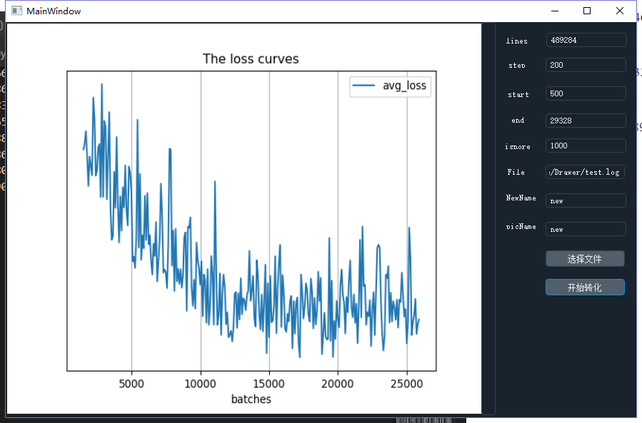

# darknet-loss-Drawer
This repository is developed on the basis of pyqt5, mainly through the log files generated during the running of Darknet, and then draw loss files.

> the release version can be used only in Windows

when you run you darknet  using scipts below:

> ./darknet detector train cfg/coco.data cfg/yolov3.cfg 

The output will like this:

> Resizing
>
> 320
>
> Loaded: 0.502709 seconds
>
> Region 30 Avg IOU: 0.453259, Class: 0.406288, Obj: 0.616954, No Obj: 0.530078, .5R: 0.500000, .75R: 0.333333,  count: 6
>
> Region 42 Avg IOU: 0.237628, Class: 0.556286, Obj: 0.263673, No Obj: 0.461042, .5R: 0.142857, .75R: 0.000000,  count: 7
>
> Region 54 Avg IOU: 0.244585, Class: 0.550149, Obj: 0.428019, No Obj: 0.469195, .5R: 0.074074, .75R: 0.037037,  count: 27
>
> Region 30 Avg IOU: 0.306451, Class: 0.559028, Obj: 0.413168, No Obj: 0.530804, .5R: 0.000000, .75R: 0.000000,  count: 4
>
> Region 42 Avg IOU: 0.262898, Class: 0.576616, Obj: 0.381279, No Obj: 0.460506, .5R: 0.111111, .75R: 0.000000,  count: 9
>
> Region 54 Avg IOU: 0.255984, Class: 0.518751, Obj: 0.423396, No Obj: 0.469569, .5R: 0.074074, .75R: 0.000000,  count: 27
>
> Region 30 Avg IOU: 0.324626, Class: 0.472797, Obj: 0.618393, No Obj: 0.529930, .5R: 0.285714, .75R: 0.000000,  count: 7
>
> Region 42 Avg IOU: 0.289221, Class: 0.723829, Obj: 0.541236, No Obj: 0.462390, .5R: 0.166667, .75R: 0.000000,  count: 6
>
> Region 54 Avg IOU: 0.237150, Class: 0.541031, Obj: 0.491277, No Obj: 0.469132, .5R: 0.045455, .75R: 0.000000,  count: 22
>
> Region 30 Avg IOU: 0.358145, Class: 0.339489, Obj: 0.425689, No Obj: 0.529440, .5R: 0.333333, .75R: 0.333333,  count: 3
>
> Region 42 Avg IOU: 0.391667, Class: 0.668793, Obj: 0.368548, No Obj: 0.461217, .5R: 0.428571, .75R: 0.000000,  count: 7
>
> Region 54 Avg IOU: 0.214031, Class: 0.543846, Obj: 0.334361, No Obj: 0.469448, .5R: 0.000000, .75R: 0.000000,  count: 29
>
> 1: 562.584595, 562.584595 avg, 0.000000 rate, 0.553693 seconds, 32 images
>
> Loaded: 0.936840 seconds
>
> Region 30 Avg IOU: 0.210395, Class: 0.535263, Obj: 0.585981, No Obj: 0.530203, .5R: 0.000000, .75R: 0.000000,  count: 5
>
> Region 42 Avg IOU: 0.246853, Class: 0.507559, Obj: 0.499927, No Obj: 0.459885, .5R: 0.125000, .75R: 0.000000,  count: 8
>
> Region 54 Avg IOU: 0.155895, Class: 0.499203, Obj: 0.295966, No Obj: 0.468601, .5R: 0.047619, .75R: 0.000000,  count: 42
>
> Region 30 Avg IOU: 0.343129, Class: 0.493684, Obj: 0.606848, No Obj: 0.528431, .5R: 0.200000, .75R: 0.200000,  count: 5
>
> Region 42 Avg IOU: 0.282754, Class: 0.626201, Obj: 0.483792, No Obj: 0.459979, .5R: 0.000000, .75R: 0.000000,  count: 8
>
> Region 54 Avg IOU: 0.205155, Class: 0.482449, Obj: 0.359561, No Obj: 0.469626, .5R: 0.027778, .75R: 0.000000,  count: 36
>
> Region 30 Avg IOU: 0.218516, Class: 0.643676, Obj: 0.513226, No Obj: 0.530422, .5R: 0.000000, .75R: 0.000000,  count: 5
>
> Region 42 Avg IOU: 0.223242, Class: 0.580035, Obj: 0.488847, No Obj: 0.460264, .5R: 0.111111, .75R: 0.000000,  count: 9
>
> Region 54 Avg IOU: 0.151966, Class: 0.455435, Obj: 0.314113, No Obj: 0.468514, .5R: 0.052632, .75R: 0.000000,  count: 38
>
> Region 30 Avg IOU: 0.362651, Class: 0.503255, Obj: 0.630907, No Obj: 0.530558, .5R: 0.400000, .75R: 0.000000,  count: 5
>
> Region 42 Avg IOU: 0.263569, Class: 0.696441, Obj: 0.464465, No Obj: 0.459764, .5R: 0.250000, .75R: 0.000000,  count: 8
>
> Region 54 Avg IOU: 0.149923, Class: 0.491762, Obj: 0.336601, No Obj: 0.467867, .5R: 0.000000, .75R: 0.000000,  count: 30
>
> 2: 583.775513, 564.703674 avg, 0.000000 rate, 0.534891 seconds, 64 images
>
> Loaded: 1.104566 seconds

so using nohup to collect the outputs:

> nohup ./darknet detector train cfg/coco.data cfg/yolov3.cfg 

and then:

> cp nohup.out log/yolov3.log

then open the exe file and fill in the parameters:

The parameters you filled in is very important:

> line:  the lines of you log file
>
> step: How many rows are sampled every time?
>
> start: from which line
>
> end: to which line
>
> ignore: Ignore the value of the previous n times.
>
> 选择文件：choose you log file
>
> newName: your extract file name
>
> picName: Name of picture saved

so, in my log file, there is 489284 lines and after extract the file, there is only 29328 lines left.

I hope you enjoy using this software.